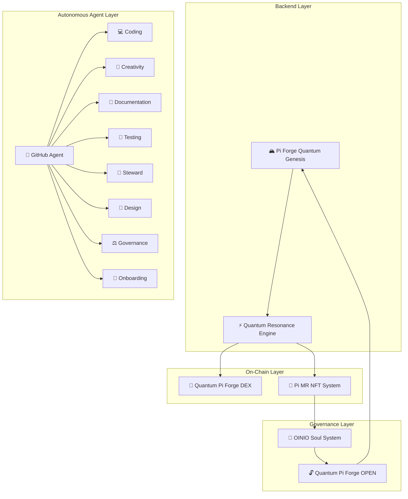

# 🏗️ Architecture Diagram  
### Structural Overview of the Autonomous Ecosystem

This page provides a visual representation of the system architecture — showing how backend, on‑chain, governance, and agent layers interconnect.

---

# 🧱 High‑Level Architecture Diagram

---

## Related Resources

- [Ecosystem Overview](Ecosystem)
- [Folder Structure](Folder-Structure)
- [Agent Documentation](Home#agents)
